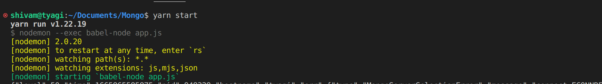

# Back end Assignment

This demonstrates all the CRUD operations and securing the endpoints using JWT and bcrypt    library

## Local Set Up

---

```markdown
git clone https://github.com/ShivamTyagi12345/Mongo.git

cd Mongo

yarn install 

yarn start

```

🌀

🌀Yay! UI accecisible on [localhost](http://localhost) :3000



## API endpoints

---

Note : I am using Postman for route checking

1. ***/create : Create a new User in the Mongo Db***

⇒ Provide the body and URI

⇒ Response: 

- Hashed password using **bcrypt**
- **JWT** token


1. ***/read : Read all the existing users in the db***

⇒ An array of all the existing users in the db


⇒ the same can be seen in the UI


1. ***/update: Update the existing user’s Password***

⇒ **However** , with the Updated password….Voila!


1. ***/ delete : Delete a User using the metadata of User Id*** 

⇒ Provide the _id parameter with the /delete route  and that deletes the user


⇒ Fun fact: Lets try sending this request again. 


This happens because we don’t have that _id in our DB anymore. 

Thanks for the read. Enjoy :)